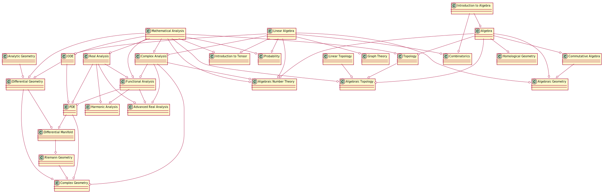

# Work Diary
### progress

- GTM 52, algebraic geometry, robin hartshorne
  - ✅🔲🔲🔲🔲🔲🔲🔲🔲🔲, chapter 1
- GTM 76, algebraic geometry, an introduction to birational geometry of algebraic varieties, 飯高茂(いいたか しげる)
  - 🔲🔲🔲🔲🔲🔲🔲🔲🔲🔲,
- EGA, Eléments de Géométrie Algébrique, A. Grothendieck
  - 🔲🔲🔲🔲🔲🔲🔲🔲🔲🔲,
- 交换代数导引, Atiyah
  - 🔲🔲🔲🔲🔲🔲🔲🔲🔲🔲,

### 中英法 部分词汇对照表  
| 中文 | English       | Français | 
| ---- | ------------- | -------- | 
| 同胚 | homeomorphism |          |
| 同构 | isomorphism   |          |
| 同态 | homomorphism  |          |
| 同伦 | homotopy      |          |
| 同调 | homology      |          |
| 上同调 | cohomology  |          |
| 全純 | holomorphism  |          |
| 亞純 | meromorphic   |          |
| 层   | scheme        |          |
| 簇   | variety       |          |
| 整环 | integral      | intégre  |
| 亏格 | genus         |          |
| 映射 | map           | application |
| 集合 | set           | ensemble | 

### navigator

