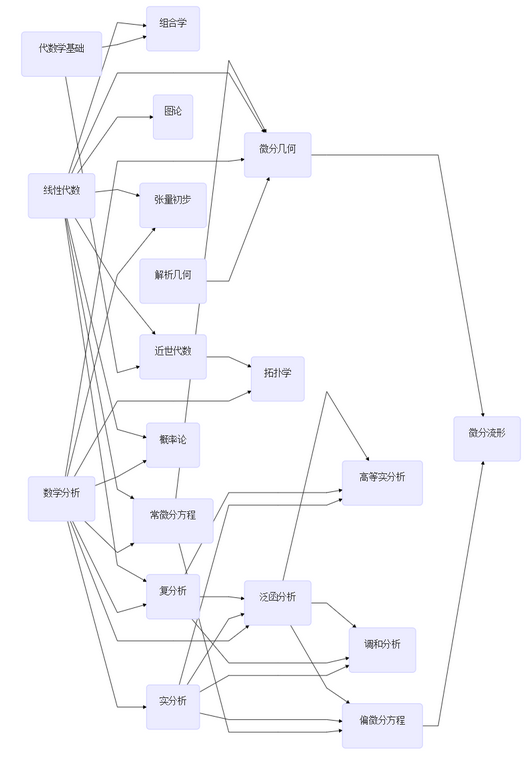
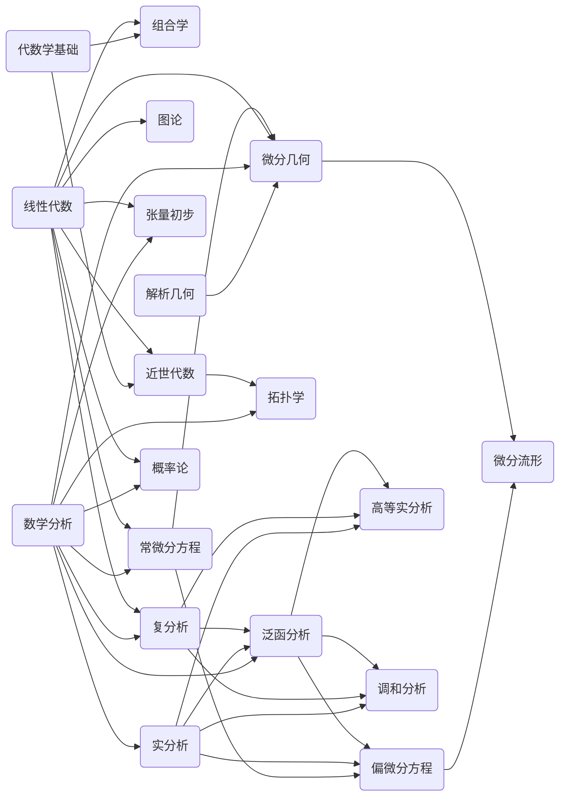

# Big Picture

-  代数学基础，基础课程，[PDF](alg-Intro.pdf) 

```mermaid
graph LR;
　　alg-intro(代数学基础)-->combi(组合学);
　　alg-intro-->alg;
　　gra-theory;
　　Anal-geo(解析几何)-->diff-geo;
　　ma-anal(数学分析)-->topo;
　　ma-anal-->ten-intro;
　　ma-anal-->diff-eq;
　　ma-anal-->complex-anal;
　　ma-anal-->real-anal;
　　ma-anal-->func-anal;
　　ma-anal-->prob;
　　ma-anal-->diff-geo;
　　lin-alg(线性代数)-->gra-theory(图论);
　　lin-alg-->ten-intro;
　　lin-alg-->complex-anal;
　　lin-alg-->alg;
　　lin-alg-->combi;
　　lin-alg-->prob;
　　lin-alg-->diff-geo;
　　lin-alg-->diff-eq;
　　diff-eq(常微分方程)-->p-diff-eq;
　　diff-eq-->diff-geo;
　　ten-intro(张量初步);
　　alg(近世代数)-->topo;
　　real-anal(实分析)-->p-diff-eq;
　　real-anal-->ad-real-anal;
　　real-anal-->func-anal;
　　real-anal-->ha-anal;
　　complex-anal(复分析)-->ha-anal;
　　complex-anal-->ad-real-anal;
　　complex-anal-->func-anal;
　　p-diff-eq(偏微分方程)-->diff-manifold;
　　diff-geo(微分几何)-->diff-manifold;
　　func-anal(泛函分析)-->p-diff-eq;
　　func-anal-->ad-real-anal;
　　func-anal-->ha-anal;
　　prob(概率论);
　　ad-real-anal(高等实分析);
　　diff-manifold(微分流形);
　　topo(拓扑学);
　　ha-anal(调和分析);
```

